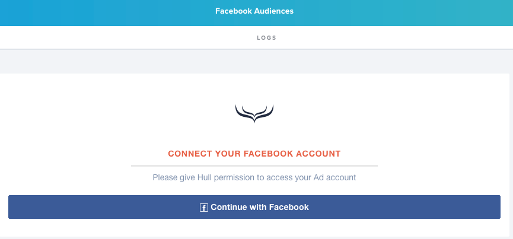
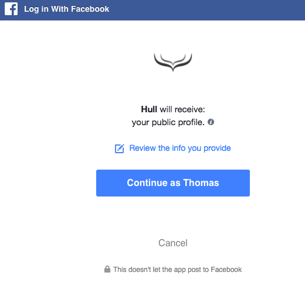
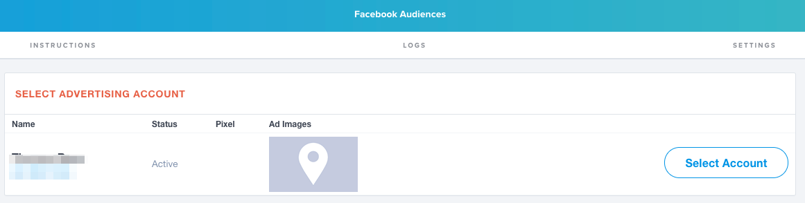
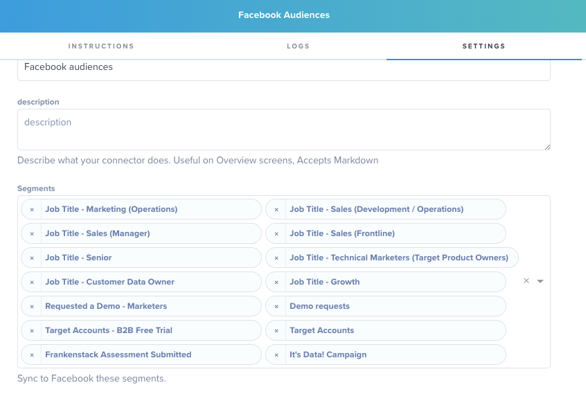
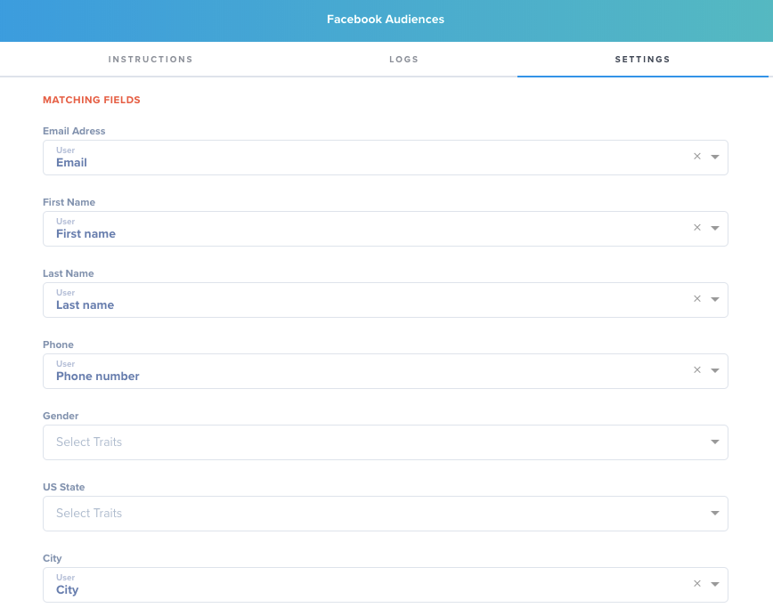
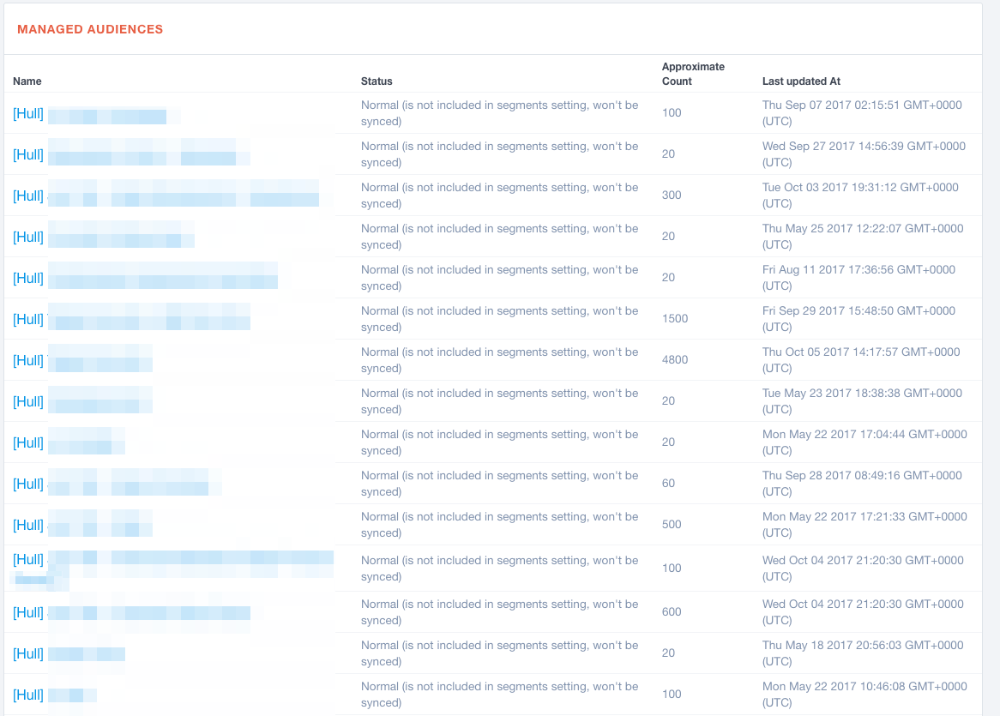

# Hull Facebook Ad Audiences Connector

The Facebook connector allows you to proactively target your ICPs whom you have emails from.

## Getting Started

Go to the Connectors page of your Hull organization, click the button “Add Connector” and click “Install” on the Facebook card. After installation, stay on the “Dashboard” tab to grant the Connector access to your Facebook Ads system.

You will get redirected to the login screen of Facebook. Authenticate the request on the Facebook website with your username and password for the Account that is using Facebook Ads:

After successful authentication you will be redirected to your Facebook connector on Hull. You are now ready to complete your setup:

Please refer to following sections to learn how to

- [Specify users to synchronize](#Specify-users-to-synchronize)
- [Determine the attributes to synchronize](#Determine-the-attributes-to-synchronize)
- [Preview audience sizes](#Preview-audience-sizes)
- [Change the ad account](#Change-the-ad-account)

## Features

The Hull Facebook Connector allows your organization to synchronize Users from and to our platform. Once you have your data in Hull, you can send it to other tools to keep your entire stack in sync.

The Facebook Connector supports sending users to target with ads on the Facebook platform. Users will be passed through with their segment name into Facebook. From there you’ll be able to build out your Facebook Ad campaigns just like you normally would.

## Specify users to synchronize

Once you are connected to Facebook you’ll have the option to add segments of users to send to Facebook automatically. In the “Segments” section under the “Settings” heading you’ll be able to select all segments you want synced.

**Important:** The Facebook Audiences Connector will only synchronize segments that you update or create after installation of the Connector. Segments prior to installation of this Connector will not be synchronized automatically.

## Determine the attributes to synchronize

The field mappings are very important to fill out as much as possible. Many of your user emails will be business emails, while most people sign up for Facebook with a personal email. Luckily, Facebook can match off of more than just email. The field mapping fields below allow you to choose any field from Hull and send it into Facebook. The more of these fields you have mapping the more likelihood you’l have to match up your users even without their personal email address on file.

## Preview audience sizes

You can preview the potential size of your audience before syncing it to Facebook by going to the “Dashboard” tab of the connector. From there you’ll see all segments you’ve created in the Hull ecosystem and the approximate audience size you can expect Facebook to match. All segments you sync to Facebook will have [Hull] as the start of the title:

Once you have selected which segments you want whitelisted Hull will do the rest for you. As soon as 1 user within the segment is updated the connector will then fetch all users within the segment and send them into Facebook.

## How to use the logs

If you click on the tab “Logs” within your Facebook Connector you can view the operational logs. The following list explains the various log messages available:

| Message                     | Description                                                                            |
| --------------------------- | -------------------------------------------------------------------------------------- |
| `facebook.api.unauthorized` | Logged when the connection to the Facebook API failed.                                 |
| `outgoing.user.error`       | Logged when an error occurred when sending the user to Facebook.                       |
| `outgoing.user.skip`        | Logged when the user doesn’t match the criteria and is therefore not send to Facebook. |
| `outgoing.user.success`     | Logged when the user has been successfully sent to Facebook.                           |

## Change the ad account

In case you need to change your linked ad account, please uninstall your current Connector and simply install a new one from the gallery.
